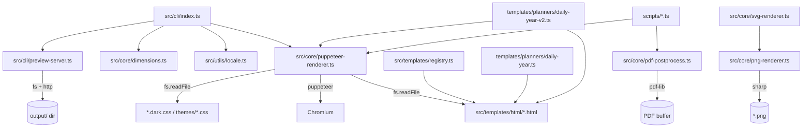

# Topology & Risk Tiering — goodnotes-templates

**Generated:** 2026-04-18 (Phase 0 of CODEX-AUDIT v1.1)
**Source tools:** `tokei` (LOC), `git log` (hotspots), `rg`/`fd` (inventory), manual read of entry points.

---

## 1. Inventory

*Source: `audit/_runtime/tool-outputs/tokei.json` (tokei 14.0.0)*

| Language | Files | Code | Comments | Blanks | Total Lines |
|---|---:|---:|---:|---:|---:|
| TypeScript | 25 | 3,451 | 865 | 587 | 4,903 |
| HTML (inline CSS included) | 33 | 6,760 | 451 | 366 | 7,577 |
| CSS (standalone) | 26 | 738 | 42 | 20 | 800 |
| Markdown | 9 | — | 1,690 | 475 | 2,165 |
| JSON | 3 | 7,183 | 0 | 0 | 7,183 |
| **Totals** | **96** | **~26.7k** | **4.2k** | **2.5k** | **~33.4k** |

**Source-to-test ratio (measured, TS only):**
- Source TS LOC (code, excluding `tests/`): ~3,100
- Test TS LOC: ~350 (3 files under `tests/unit/`)
- Ratio: ~11% — thin. Nothing covers `puppeteer-renderer.ts`, `pdf-postprocess.ts`, `svg-renderer.ts`, CLI, preview-server.

**Repo age:** 9 days, 32 commits (first commit 2026-04-09). Treat this as early-stage — not a legacy audit.

---

## 2. Monorepo detection

**Result: NOT a monorepo.**

Checked:
- `pnpm-workspace.yaml`, `lerna.json`, `turbo.json`, `nx.json` — absent
- `go.work`, `Cargo.toml` workspace — absent
- `package.json` `.workspaces` — absent

All findings will use `package: "<root>"`.

---

## 3. Entry points

| Entry | File | Trust boundary | Notes |
|---|---|---|---|
| CLI `goodnotes-templates` | `src/cli/index.ts` | CLI flags (semi-trusted) | Commander-based; `render`, `list`, `preview` |
| Preview HTTP server | `src/cli/preview-server.ts` | **Network (localhost by default)** | `http.createServer`, serves `output/` dir with path-traversal guard |
| Puppeteer engine | `src/core/puppeteer-renderer.ts` | Reads local HTML/CSS files | Launches Chromium with `--no-sandbox --disable-setuid-sandbox` |
| SVG sticker generator | `src/core/svg-renderer.ts` | Pure function | Inputs are hard-coded palettes + sticker type enum |
| Sharp PNG renderer | `src/core/png-renderer.ts` | Processes SVG strings | Rasterizes via `sharp` |
| PDF postprocessor | `src/core/pdf-postprocess.ts` | Processes Puppeteer output buffer | `pdf-lib` — adds bookmarks, hyperlinks |
| Ad-hoc scripts | `scripts/*.ts` | CLI args | 9 tsx scripts for batch rendering / debugging |
| Year planner builder | `src/templates/planners/daily-year*.ts` | Reads multiple HTML template files | Largest TS files in repo (~27k + 22k chars) |

---

## 4. Trust boundaries

Places where data leaves or enters an implicit trust zone:

1. **CLI flags → file I/O** (`src/cli/index.ts:41,47`): user-supplied `template` path is `fs.access`-ed then passed to Puppeteer. Output path is derived via string replace; no canonicalization.
2. **HTTP server `GET /*`** (`src/cli/preview-server.ts:25–62`): serves arbitrary files under `output/`. Has an explicit path-traversal guard at line 39 (`filePath.startsWith(absDir + path.sep)`). Binds to all interfaces via `server.listen(port)` (no host arg) — depends on Node's default.
3. **Gallery-page filename → HTML**: `generateGalleryHTML` escapes filenames with a bespoke `esc()` at `preview-server.ts:95`. Filenames come from `fs.readdir(output/)` — not remote, but still injected into HTML.
4. **Chromium launch args** (`puppeteer-renderer.ts:32–38`): `--no-sandbox --disable-setuid-sandbox`. Chromium is fed local HTML read from disk, no network input by default, but `waitUntil: 'networkidle0'` implies remote requests are allowed.
5. **Color-mode CSS lookup** (`puppeteer-renderer.ts:96,101`): path derived by concatenation of `htmlPath` + `colorMode`. `colorMode` comes from CLI flag → controllable.

No auth, session, crypto, DB, PII, or multi-tenant surfaces. No external API calls. This is a build-tool codebase, not a service.

---

## 5. Dependency graph

Top-level dependency map (manual trace; `madge` is missing from the sandbox):

A full `madge` run will be attempted in Phase 3 if `npx madge` succeeds (network:yes).

---

## 6. Runtime dependency surface

From `package.json`:

**Production (12):** `pdf-lib`, `pdfkit`, `puppeteer 23.x`, `sharp 0.33.x`, `@svgdotjs/svg.js`, `svgdom`, `commander`, `chalk`, `ora`, `glob`, `handlebars`, `fontkit`.

**Dev (10):** `typescript 5.6`, `tsx 4.19`, `vitest 2.1`, `@types/*`, `eslint 9`, `prettier 3.4`, `looks-same`, `@typescript-eslint/*`.

**Observed unused dependencies (hinted — verify in Phase 2 with `depcheck`):**
- `handlebars` — no `rg` hit for `Handlebars`, `handlebars`, `.hbs` files. Candidate for removal.
- `pdfkit` and `@types/pdfkit` — no `rg` hit; `pdf-lib` is the actual PDF library used.
- `@svgdotjs/svg.js` and `svgdom` — Phase 5 will confirm vs `svg-renderer.ts` (which appears to template SVG as strings).
- `fontkit` — Phase 5 to confirm.
- `glob` — Phase 5 to confirm vs `fd`/`readdir`.

These will become Phase 2 findings once confirmed by `depcheck`.

---

## 7. Module → risk tier table

Tiering is **proportional to blast radius of a defect**, not popularity. This repo has no auth/crypto/PII; nothing qualifies as "T1 Critical" in the security-sensitive sense. **T1 here is scoped to "the defect can corrupt user output or expose a path-traversal/RCE-class issue in the dev-server."**

| Module | Path | Tier | Why |
|---|---|---|---|
| Preview HTTP server | `src/cli/preview-server.ts` | **T1** | Network-facing. Any path-traversal or content-type bug here is exploitable on a dev machine. Filename → HTML injection surface. |
| Puppeteer renderer | `src/core/puppeteer-renderer.ts` | **T1** | `--no-sandbox` Chromium launch. If a malicious HTML template is rendered, sandbox escape is more likely. Also the hot-path defect surface. |
| PDF post-processor | `src/core/pdf-postprocess.ts` | **T1** | Handles untrusted PDF buffers (via `PDFDocument.load`). Off-by-one, type confusion in PDF parsing can corrupt outputs or crash process. Pagination clamping + coord math lives here. |
| Year-planner builders | `src/templates/planners/daily-year.ts`, `daily-year-v2.ts` | **T2** | Large (~22k + 27k chars). Biggest correctness/complexity surface. Regex-parses HTML head to pull `<style>`. Consumed by the most-churned renderer path. |
| Dimensions / locale utils | `src/core/dimensions.ts`, `src/utils/locale.ts` | **T2** | Date math (leap year, ISO week), grid math. Defects silently produce wrong calendars. Has real tests, which helps. |
| SVG + PNG renderers | `src/core/svg-renderer.ts`, `src/core/png-renderer.ts` | **T2** | Large surface (~480 LOC), handles 19 sticker types. No tests. |
| CLI entry | `src/cli/index.ts` | **T2** | Flag parsing + derived output paths. User-supplied template path is `fs.access`-checked but not canonicalized. |
| Template registry | `src/templates/registry.ts` | **T3** | Static metadata; defect = broken listing, not corruption. |
| HTML/CSS templates (33 files) | `src/templates/html/*.html`, `*.dark.css` | **T3** | Static content. Defects = visual only. Spot-check for inline `<script>`, external URLs. |
| Theme CSS (8 themes) | `src/templates/themes/*.css` | **T4** | Pure styles. Pattern scan only. |
| Scripts (9 TS files) | `scripts/*.ts` | **T3** | Ad-hoc; developer-only surface. Some read files from `output/` without path validation (fine since developer-only). |
| Tests | `tests/unit/*.ts` | **T4** | Audit target is code quality of tests, not their defects. |
| Docs | `docs/**/*.md`, top-level `*.md` | **T4** | Claim-verification in Phase 1. |

**Change-hotspot upgrades:** `src/core/puppeteer-renderer.ts` (5 changes / 6mo) and `src/templates/registry.ts` (4 changes) are already T1/T3 respectively — no bumps needed. `daily-year-v2.ts` (4 changes) stays T2.

---

## 8. Top-5 "what matters most if broken"

1. **`puppeteer-renderer.ts`** — every user-visible PDF flows through this. Sandbox-disabled Chromium launch is the highest-leverage security lever in the repo.
2. **`pdf-postprocess.ts`** — responsible for link/bookmark correctness inside delivered PDFs; buggy coord math silently ships broken navigation.
3. **`preview-server.ts`** — the only network-exposed component. Path-traversal regression here is the single most exploitable risk.
4. **`daily-year-v2.ts`** — largest TS file; regex-parses HTML; if it miscalculates day counts the yearly planner is wrong for 365 days.
5. **`locale.ts` + `dimensions.ts`** — small, foundational, powers calendar math. A one-line fix at the bottom ripples into every dated template.

---

## 9. Exit-gate answers

- **Monorepo?** No. Single package.
- **Top-5 if broken?** Listed above (§8).
- **Where does untrusted input enter?** CLI flags, HTTP server requests, HTML template files on disk (trusted-ish since shipped in-repo, but parsed by code paths that must not regress safety).
- **Test-to-source ratio?** ~11% (**measured** from `tokei` + file count under `tests/unit/`). Actual coverage % will be measured in Phase 6.

---

## 10. Proposed Phase-1…Phase-10 plan (for checkpoint)

| Phase | Planned action | Subagent? | Approx budget |
|---|---|---|---|
| 1 — Docs alignment | Read README, CLAUDE.md, PROBLEM_STATEMENT.md, RESEARCH.md, HLD, LLD, spec doc; build claims ledger | No | Single pass |
| 2 — Supply chain | `npm audit`, `npx depcheck`, `npx license-checker`, `npx osv-scanner` (via `@google/osv-scanner` or `pipx install osv-scanner`), `npx @cyclonedx/cdxgen` for SBOM. Skip IaC/container (no Dockerfile, no k8s, no terraform). | Optionally parallel | 5–10 min |
| 3 — Architecture | Score rubric (Modularity, Scalability, Resilience, Testability, Deployability, Observability). Scalability & Resilience mostly N/A (build tool). | No | Medium |
| 4 — Threat model | STRIDE on 3 trust boundaries (CLI, HTTP server, Puppeteer). LINDDUN not applicable (no PII). | No | Short |
| 5 — Code review | T1 line-by-line (3 files: `preview-server.ts`, `puppeteer-renderer.ts`, `pdf-postprocess.ts`). T2 function-level (year planners, svg-renderer, locale, dimensions, cli). T3 spot-check (registry, scripts, HTML template scan for `<script>`/external URLs). | Optional per-module subagent | Longest |
| 6 — Tests & gates | `npm run test -- --coverage`. Flag absence of fuzz/property/contract tests (none needed for this scope; report as "not applicable for this class of tool"). Check CI gates — **no `.github/workflows/`** → High finding. | No | Short |
| 7 — Performance & obs | Static review only. Bundle/LCP/INP/CLS → `NOT MEASURED — not a web app`. Puppeteer startup cost, memory usage on full-year generation: review for obvious hot-path issues. | No | Short |
| 7.5 — Privacy & compliance | `not_applicable` — no PII, no user accounts, no logs of anything sensitive. Short finding. | No | Very short |
| 8 — UI/UX & a11y | Scope: the HTML templates themselves (they're user-facing PDFs once rendered). Contrast check on the 8 themes. WCAG 2.2 → but these are **static paper-style planners**, not interactive web UI; most WCAG SC don't apply. Assess anyway for keyboard/contrast/text alternatives. | No | Medium |
| 9 — Consolidation | CVSS-or-RICE on each finding, risk matrix, dedup. | No | Short |
| 10 — Deliverables | Report + roadmap + test-strategy + slide outline. | No | Short |
| Iter 2 — Depth | Re-drill top 3 risks from iter-1 (`preview-server.ts`, `puppeteer-renderer.ts`, year planner builders). | Optional | Medium |
| Iter 3 — Adversarial | Subagent attempts to refute each iter-1/2 finding using the evidence pack. | **Yes (1 subagent)** | Short |
